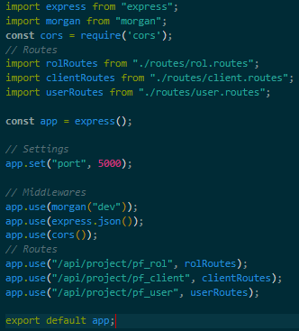

# proyecto_final_analisis

## Ejecución
No necesita la instalación de ninguna dependencia.
	
## Observaciones
Al momento de hacer fetch de los datos, puede dar error en la API. [Stackoverflow](https://stackoverflow.com/questions/63432473/access-to-fetch-url-been-blocked-by-cors-policy-no-access-control-allow-orig)

Se soluciona agregando los siguientes comandos en "app.js" de la API:
	
	const cors = require('cors'); //En los imports

    app.use(cors()); //En los middlewares

Justo así:

